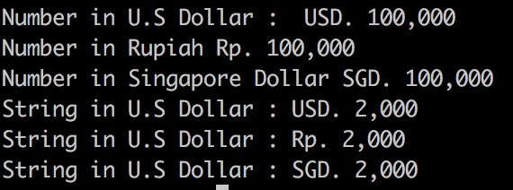

# san-money


san_money - Formats a number / String input as a currency


## Installation

```sh

$ npm install san-money

```

## Example Code

```sh

const san = require('san-money')
const dollar = "USD. "
const rupiah = "Rp. "
const singDollar = "SGD. "
const num = 100000
const str = "2000"

console.log("Number in U.S Dollar : ",san.money(num, dollar))
console.log("Number in Rupiah",san.money(num, rupiah))
console.log("Number in Singapore Dollar",san.money(num, singDollar))

console.log("String in U.S Dollar :",san.money(str, dollar))
console.log("String in U.S Dollar :",san.money(str, rupiah))
console.log("String in U.S Dollar :",san.money(str, singDollar))
```

## Output

```sh

$ node index.js

```



## Develop By

 - [sanbastia](https://github.com/sanBastia)

[Go to npmjs for this package](https://www.npmjs.com/package/san-money)

**Free Software, Hell Yeah!**
